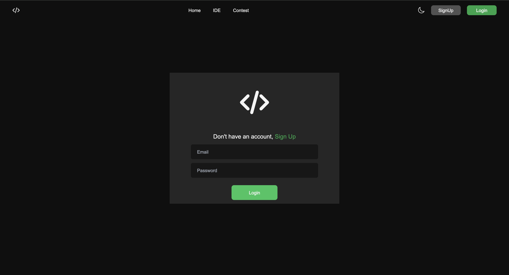
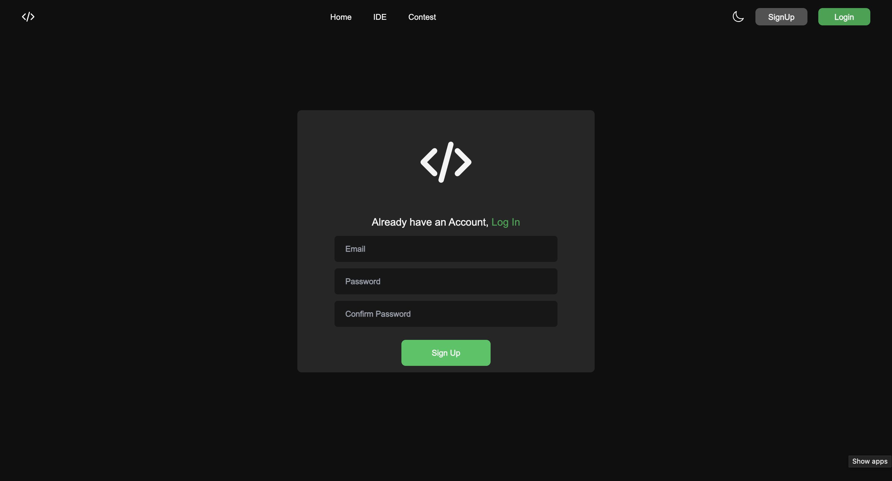
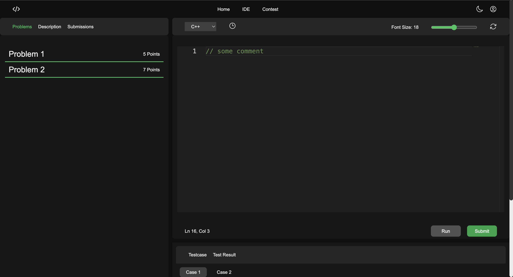

# CodeEasy: A Code Editor and Contest Platform 🚀

This is a full-stack application built with Turborepo, Next.js, Express.js, and Kafka. It provides a web interface for users to submit code, which is then processed by a backend service via a message queue for execution.

## Screenshots






## Project Structure 🏗️

This project is a monorepo containing several applications and shared packages.

```
/
├── apps/
│   ├── web/          (Package name: "contest_frontend") - The Next.js frontend application.
│   ├── server/       (Package name: "codeeditor") - The main backend Express.js server.
│   ├── docs/         (Package name: "docs") - The documentation site.
│   └── kafka-server/ (Package name: "kafka-server") - Handles incoming code submissions.
└── packages/
    ├── ui/           - Shared React components.
    ├── eslint-config/ - Shared ESLint configuration.
    └── typescript-config/ - Shared TypeScript configuration.
```

## Features ✨

  * **Monorepo Architecture:** Managed with Turborepo for efficient development and builds.
  * **Next.js Frontend:** A modern, server-rendered React application for the user interface.
  * **Express.js Backend:** A robust Node.js server to handle API requests and business logic.
  * **Asynchronous Code Execution:** Uses Kafka as a message broker to queue and process code submissions reliably.
  * **Database Integration:** Connects to MongoDB Atlas for data persistence.
  * **Live Development:** Uses `nodemon` for automatic backend restarts.
  * **Containerized Services:** Uses Docker to run essential services like Kafka.

-----

## Prerequisites 🔧

Before you begin, ensure you have the following installed on your system:

  * [**Node.js**](https://nodejs.org/en/) (v18 or later)
  * [**npm**](https://www.npmjs.com/) (comes with Node.js)
  * [**Docker Desktop**](https://www.docker.com/products/docker-desktop/)
  * A **MongoDB Atlas** account and a cluster set up.

-----

## Getting Started 🛠️

Follow these steps to get the project running on your local machine.

### 1\. Clone the Repository

Clone this project to your local machine.

```sh
git clone <your-repository-url>
cd CODEEASY
```

### 2\. Install Dependencies

Install all the necessary dependencies for all packages from the root directory.

```sh
npm install
```

### 3\. Set Up Environment Variables

Your backend server needs a `.env` file to connect to your database.

1.  Navigate to the main backend server directory: `cd apps/server`.

2.  Create a new file named `.env`.

3.  Add your MongoDB Atlas connection string to this file. **Remember to replace `<username>`, `<password>`, and other placeholders with your actual database user credentials.**

    ```
    DATABASE_URI=mongodb+srv://<username>:<password>@your-cluster-address.mongodb.net/your_database_name?retryWrites=true&w=majority
    ```

4.  Navigate back to the root directory: `cd ../..`.

### 4\. Start Dependent Services (Kafka)

This project requires Kafka to be running. We use Docker to manage this.

1.  Ensure Docker Desktop is open and running.
2.  In a separate terminal window, navigate to the project root and run:
    ```sh
    docker-compose up
    ```
3.  Leave this terminal window running. It is now your Kafka server.

-----

## Development Commands 💻

All commands should be run from the **root directory** of the project.

### Running All Applications

To start all applications (`contest_frontend`, `codeeditor`, etc.) at once:

```sh
npm run dev
```

### Running a Single Application

To run a specific application, use the `--filter` flag with the package's **official name**.

  * **To run the Frontend Web App:**

    ```sh
    npm run dev -- --filter=contest_frontend
    ```

    This will start the Next.js app, typically on `http://localhost:3000`.

  * **To run the Backend Server:**

    ```sh
    npm run dev -- --filter=codeeditor
    ```

    This will start the Express.js server, typically on `http://localhost:8000`.

  * **To run the Worker Script (`server1.js`):**

    ```sh
    npm run dev:worker -- --filter=codeeditor
    ```

-----

## Kafka Integration: Submitting Code for Execution 📨

The system is designed to accept code submissions via a dedicated Kafka endpoint.

### Submitting a File

To send a file to the Kafka server for processing, send it to:
**`http://localhost:3003`**

*(This endpoint is likely managed by the `kafka-server` application.)*

### Creating Kafka Topics

Before the application can use a topic, it must be created. For example, to create the `CPP` topic for C++ code submissions:

1.  Make sure your Docker Kafka container is running.
2.  Open a new terminal and run the following command from the project root:
    ```sh
    docker-compose exec kafka kafka-topics --create --topic CPP --bootstrap-server localhost:9092 --partitions 1 --replication-factor 1
    ```
    You should see a confirmation message: `Created topic CPP.`

-----

## Building for Production 📦

To build all applications for production, run the following command from the root directory:

```sh
npm run build
```

-----

## Included Utilities

This Turborepo includes:

  - **TypeScript** for static type checking.
  - **ESLint** for code linting.
  - **Prettier** for code formatting.